# Hi, I'm Neil Bauman 👋

  
  

## About me

I build practical products across **AI tooling**, **full-stack platforms**, and **embedded intelligent systems**. I care about clear interfaces, dependable engineering, and taking ideas all the way from prototype to something people can actually use.

我专注于 AI 工具、全栈产品与智能硬件，把想法做成真正可用、可靠、好用的系统。

- 🔭 Currently building tools for the AI-agent ecosystem
- 🧩 Enjoy working across product, software, and hardware boundaries
- 🌱 Always exploring better ways to design, automate, and ship
- 💬 Happy to connect around AI agents, product engineering, and open source

## More from me

<table>
  <tr>
    <td width="96" valign="top">
      
    </td>
    <td valign="top">
      <strong><a href="https://github.com/neilbauman666">@neilbauman666</a> · Catnip</strong> 
      My alternate GitHub account for Catnip projects, experiments, and earlier builds.  
      
    </td>
  </tr>
</table>

| From the alternate account | Index |
| --- | --- |
| [Catnipent](https://github.com/neilbauman666/Catnipent) | TypeScript project |
| [Catnip Skill Hub](https://github.com/neilbauman666/Catnip-skill-hub-main) | Agent Skill discovery hub |
| [Catnip Forge Open](https://github.com/neilbauman666/Catnip_Forge_Open) | Public fork and experimentation space |

## Selected work

| Project | What it is | Stack |
| --- | --- | --- |
| [Catnip Skill Hub](https://github.com/NeilBaumanMax/Catnip-Skill-Hub) | A discovery platform for reusable Agent Skills | Next.js · TypeScript · PostgreSQL |
| [Catnipent](https://github.com/NeilBaumanMax/Catnip-Intro) | A full-stack site for local AI-agent hardware and software | Next.js · Go · SQLite |
| SmartRollator | An intelligent rollator control system with compliant motion control | STM32 · FreeRTOS · C |

## Toolbox

  

## GitHub at a glance

  <picture>
    <source media="(prefers-color-scheme: dark)" srcset="./profile/stats-dark.svg" />
    
  </picture>
  <picture>
    <source media="(prefers-color-scheme: dark)" srcset="./profile/top-langs-dark.svg" />
    
  </picture>

## Contribution trail

  <picture>
    <source media="(prefers-color-scheme: dark)" srcset="https://raw.githubusercontent.com/NeilBaumanMax/NeilBaumanMax/output/github-contribution-grid-snake-dark.svg" />
    <source media="(prefers-color-scheme: light)" srcset="https://raw.githubusercontent.com/NeilBaumanMax/NeilBaumanMax/output/github-contribution-grid-snake.svg" />
    
  </picture>

### Build with curiosity. Ship with care.

