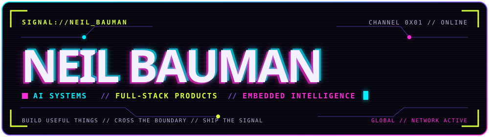

<!--
THESIS: A pirate broadcast for a builder across AI, product, and embedded systems; it refuses the generic badge-wall profile.
OWN-WORLD: Void-violet panels, plasma magenta identity, electric-cyan navigation, ultraviolet depth, acid live signals, circuit geometry, and contained neon bloom.
STORY: Visitors identify Neil, scan real work, discover both GitHub channels, read technical telemetry, and leave through a memorable arcade transmission.
FIRST VIEWPORT: A full-width authored broadcast panel leads; identity and disciplines dominate, followed by live channel chips and one concise transmission.
FORM: Experience-mode intercepted signal terminal; the user pinned the cyberpunk direction, so no concept seed was required.
-->

  

  

  

    
    
    
    
  

## ◈ SYSTEM PROFILE

> **TRANSMISSION //** I build practical products across **AI tooling**, **full-stack platforms**, and **embedded intelligent systems**—turning ambitious ideas into reliable things people can actually use.

我专注于 AI 工具、全栈产品与智能硬件，把想法做成真正可用、可靠、好用的系统。

| Signal | Current coordinates |
| --- | --- |
| `BUILDING` | Tools for the AI-agent ecosystem |
| `CROSSING` | Product, software, and hardware boundaries |
| `EXPLORING` | Better ways to design, automate, and ship |
| `OPEN LINE` | AI agents · product engineering · open source |

## ⌁ SECOND CHANNEL

<table>
  <tr>
    <td width="96" valign="top">
      
    </td>
    <td valign="top">
      <strong><a href="https://github.com/neilbauman666">@neilbauman666</a> // CATNIP</strong> 
      Alternate channel for Catnip projects, experiments, and earlier builds.  
      
    </td>
  </tr>
</table>

| Callsign | Repository signal |
| --- | --- |
| [Catnipent](https://github.com/neilbauman666/Catnipent) | `TypeScript` project |
| [Catnip Skill Hub](https://github.com/neilbauman666/Catnip-skill-hub-main) | Agent Skill discovery hub |
| [Catnip Forge Open](https://github.com/neilbauman666/Catnip_Forge_Open) | Public fork and experimentation space |

## ✦ ACTIVE BUILDS

| Project | Mission | Core stack |
| --- | --- | --- |
| [Catnip Skill Hub](https://github.com/NeilBaumanMax/Catnip-Skill-Hub) | Discovery platform for reusable Agent Skills | `Next.js` `TypeScript` `PostgreSQL` |
| [Catnipent](https://github.com/NeilBaumanMax/Catnip-Intro) | Full-stack site for local AI-agent hardware and software | `Next.js` `Go` `SQLite` |
| SmartRollator | Intelligent rollator control with compliant motion | `STM32` `FreeRTOS` `C` |

## ⬡ TOOLCHAIN

  

## ⟡ LIVE TELEMETRY

  
  

## ⚡ CONTRIBUTION SNAKE // 贡献轨迹

  <picture>
    <source media="(prefers-color-scheme: dark)" srcset="https://raw.githubusercontent.com/NeilBaumanMax/NeilBaumanMax/output/github-contribution-grid-snake-dark.svg" />
    <source media="(prefers-color-scheme: light)" srcset="https://raw.githubusercontent.com/NeilBaumanMax/NeilBaumanMax/output/github-contribution-grid-snake.svg" />
    
  </picture>

  <code>真实贡献记录</code> · <code>每日自动更新</code> · <code>霓虹朋克配色</code>

  
  

